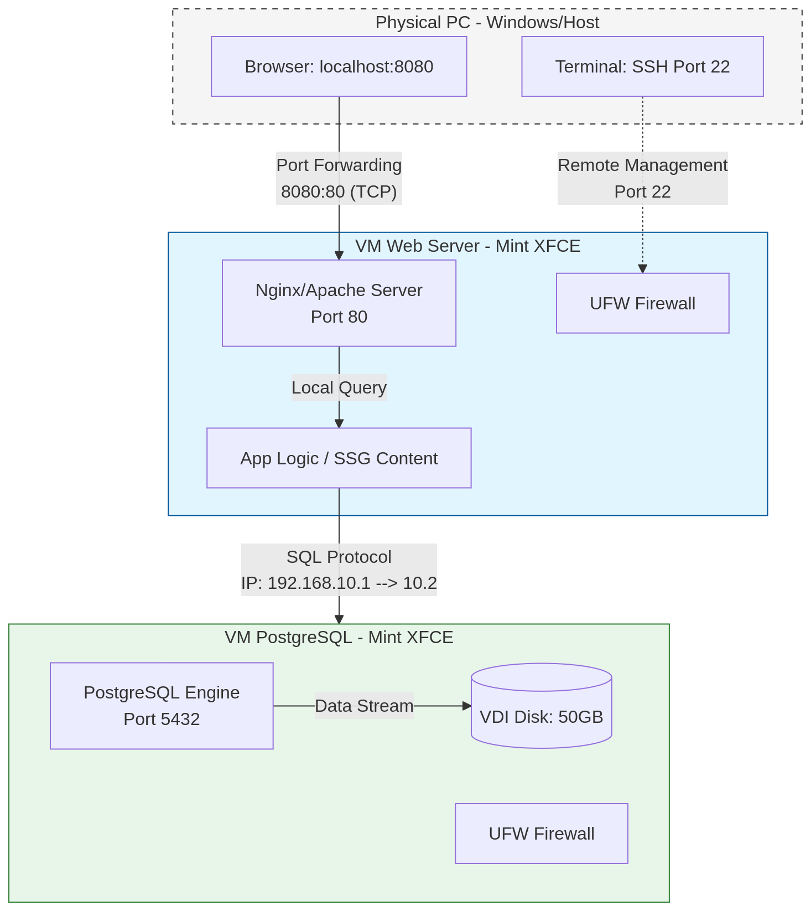

# CHALLENGES-BASED WEB PROJECT | STATIC SITE GENERATION 
This project has been created to improve our web development skills.

## STEPS: DAY 1
### Products To Sell / Theme
- **VIDEOGAMES**

### Product's API [CheapShark](https://cheapshark.com))
We have selected a **single-API strategy** to meet our project requirements:
- **CheapShark API:** Used specifically for **real-time pricing and deals**. Since RAWG does not provide live prices, CheapShark fills this gap by offering updated costs and purchase links for PC games across multiple stores.

### Doc Research

#### 1. API Fetching (Scraping) with Python
API fetching consists of making direct HTTP requests to server endpoints to obtain structured data.

- **Main Libraries:**
  - `requests`: The standard tool for sending `GET` and `POST` requests.
  - `json`: Native library to process and save the data.
        
- **Workflow:**
  - **Identify Endpoints:** Get the **API Key** by registering at [RAWG](https://rawg.io). CheapShark does not require a key.
  - **Send Request:** Use `requests.get(url)` to fetch the response from both APIs.
  - **Process JSON:** Convert the text response into a Python dictionary using `response.json()`.
  - **Data Merging:** Cross-reference the results (usually by matching the game title) to combine RAWG images with CheapShark prices into a single object.

#### 3. Secure Server Implementation (HTTPS)
To ensure a secure server, the connection must be wrapped in an SSL/TLS encryption layer.

- **Requirements:** A certificate (`cert.pem`) and a private key (`key.pem`) are needed.
- **Development:** Self-signed certificates can be generated with **OpenSSL**. In Python, this is implemented using `http.server` combined with the `ssl` module to wrap the socket.

#### 4. Two-Factor Authentication (2FA)
2FA adds a security layer where the user provides something they know (password) and something they have (a code on their mobile device).

- **TOTP (Time-based One-Time Password):** The most common method (compatible with Google Authenticator).
- **Recommended Library:** `PyOTP`.
  - **Step 1:** Generate a **unique secret key** for the user.
  - **Step 2:** Display a **QR Code** that the user scans with their authenticator app.
  - **Step 3:** Verify the **6-digit code** entered by the user during login.

### VMs Technical Specifications

| Configuración | VM Servidor Web (SSG) | VM Base de Datos (PostgreSQL) |
| :------------ | :-------------------- | :---------------------------- |
| **Sistema Operativo** | Linux Mint (22.3) Xfce | Linux Mint (22.3) Xfce |
| **Versión (VBox)** | Ubuntu (64-bit)| Ubuntu (64-bit) |
| **Procesador (vCPU)** | 4 Cores | 4 Cores |
| **Memoria RAM** | 4 GB | 8 GB |
| **Disco Virtual** | 25 GB (Dynamic VDI) | 50 GB (Dynamic VDI) |
| **Tipo de Red** | NAT (Internet) | Internal Net (Host-only) |
| **Usuario Sistema** | `project_web` | `project_db` |
| **Propósito de Red** | External Access/Internet | Data isolation and security |


### Architecture Diagram


## STEPS: DAY 2

### Installation of PostgreSQL and PgAdmin4

We started by installing the PostgreSQL DBMS.

To do this, we opened one of the virtual machines created the previous day, opened the terminal, and executed the following command:

```bash
apt install postgresql
```

Next, we configured the automated repository using the following commands:

```bash
sudo apt install -y postgresql-common
sudo /usr/share/postgresql-common/pgdg/apt.postgresql.org.sh
```

After executing these commands, PostgreSQL was successfully installed and ready to use.

Then, on the second virtual machine, we proceeded with the installation of the PgAdmin4 database administration tool.

First, we installed the public key for the repository:

```bash
curl -fsS https://www.pgadmin.org/static/packages_pgadmin_org.pub | sudo gpg --dearmor -o /usr/share/keyrings/packages-pgadmin-org.gpg
```

Next, we created the repository configuration file:

```bash
sudo sh -c 'echo "deb [signed-by=/usr/share/keyrings/packages-pgadmin-org.gpg] https://ftp.postgresql.org/pub/pgadmin/pgadmin4/apt/$(lsb_release -cs) pgadmin4 main" > /etc/apt/sources.list.d'
```

Finally, we installed PgAdmin4:

```bash
sudo apt install pgadmin4-web
```

Since our installation was web-only, we also configured the web server:

```bash
sudo /usr/pgadmin4/bin/setup-web.sh
```

---

# Functional Requirements Definition

Once the installations were completed, we started defining the functional requirements of our application.

We analyzed the project needs and the tasks each part of the system had to perform. Based on this analysis, we identified the main functionalities required for the application.

We defined how products would be stored in the database and how this information would be automatically obtained using a Python scraping program that extracts products from different websites. We also organized the server and virtual machine configuration required for the application to work correctly.

Additionally, we designed the HTML templates and CSS styles for the visual part of the application and used GitHub to organize teamwork, manage changes, and document the project.

Finally, we developed an AI skill capable of receiving an online store URL and automatically generating a JSON file compatible with our project. During this process, we continuously improved and documented the results to achieve greater accuracy and robustness.

---

### Relational Model of the Database

To obtain the relational model of our database, we first analyzed the information the application needed to manage and the relationships between the different data elements.

Based on the previously defined functional requirements, we identified the main entities of the system.

Then, we organized this information into PostgreSQL tables, defining the necessary fields for each one and establishing relationships between them. This allowed us to structure the data in an organized way.

We also reviewed how the different application modules interacted with the database to ensure that the model covered the project requirements and facilitated both data storage and querying of the information obtained through scraping.

---

### PostgreSQL Database Creation Using PgAdmin4

To define and create our PostgreSQL database, we used PgAdmin4.

First, we installed PostgreSQL and PgAdmin4 on the virtual machine configured for the project. Once the server was running, we accessed PgAdmin4 and created a new database from the administration panel.

Next, we defined the required tables according to the relational model we had previously designed. For each table, we established its columns, data types, and relationships.

### Database Structure

#### Game Table

```sql
CREATE TABLE Game (
    game_id SERIAL PRIMARY KEY,
    title VARCHAR(255) NOT NULL,
    description TEXT,
    release_date DATE,
    rating NUMERIC(3,2),
    background_image VARCHAR(512)
);
```

This table stores the main information about video games obtained from the RAWG API.

---

#### Store Table

```sql
CREATE TABLE Store (
    store_id INT PRIMARY KEY,
    name VARCHAR(100) NOT NULL,
    base_url VARCHAR(255)
);
```

This table stores information about digital stores obtained from the CheapShark API.

---

#### Genre Table

```sql
CREATE TABLE Genre (
    genre_id INT PRIMARY KEY,
    name VARCHAR(100) NOT NULL,
    slug VARCHAR(100)
);
```

This table stores the different game genres from the RAWG API.

---

#### Game_Genre Table

```sql
CREATE TABLE Game_Genre (
    game_id INT REFERENCES Game(game_id) ON DELETE CASCADE,
    genre_id INT REFERENCES Genre(genre_id) ON DELETE CASCADE,
    PRIMARY KEY (game_id, genre_id)
);
```

This bridge table manages the many-to-many relationship between games and genres.

---

#### Deal Table

```sql
CREATE TABLE Deal (
    deal_id VARCHAR(100) PRIMARY KEY,
    game_id INT REFERENCES Game(game_id) ON DELETE CASCADE,
    store_id INT REFERENCES Store(store_id) ON DELETE CASCADE,
    price NUMERIC(6,2) NOT NULL,
    retail_price NUMERIC(6,2),
    savings NUMERIC(5,2),
    purchase_url TEXT
);
```

This table stores real-time pricing, discounts, and purchase links from the CheapShark API.

---

Finally, we verified that all tables and relationships worked correctly. This prepared the database so that our Python application could automatically store and manage the information extracted from external APIs.

---

### Network Configuration Between Virtual Machines

Finally, we configured the network between the virtual machines containing the PostgreSQL database and the web server to allow communication between both systems.

For this, we used VirtualBox to create and manage the project virtual machines.

First, we configured the network adapters of each virtual machine using either an internal network or a NAT network with a host-only adapter so that both machines could communicate within the same virtual environment.

Then, we tested the connectivity between them using the following command:

```bash
ping SERVER_IP
```

Once the connection was established, we configured PostgreSQL to accept remote connections from the web server virtual machine.

To do this, we modified the `postgresql.conf` file with the following configuration:

```conf
listen_addresses = '*'
```

Finally, we restarted the PostgreSQL service and verified that the web server could successfully connect to the database using the IP address of the virtual machine hosting it.

With this configuration, we managed to separate services across different virtual machines and simulate an architecture closer to a real-world environment.

## STEPS: DAY 3
---
## STEPS: DAY 4

> ⚠️ **READ ALL POINTS BEFORE DOING ANYTHING ELSE**

## 📋 Prerequisites
To move forward today, you must have completed the following from the previous session:
* Selected the product to sell.
* Defined the parameters that describe your product (name, description, image, and price).
* Created the virtual machine with LinuxMint OS to host the database.
* Installed and configured the database.
* Developed the Python web scraping application and saved the data to the database.
* Developed the application to read from the database and populate the HTML.

> 📝 **NOTE:** Apparently, during the last session, not all groups had enough time to finish the application that reads the database and populates your website.
> 
> I have opened "Day 27 Assignment" so you can replace your submitted work. This ensures the assignment has both complete scripts so the Rubric can be applied correctly.
> 
> **Great! Finish this part before moving on.**

---

## 🤖 Today's Challenge: Can AI Help Us?

At this point... do you think AI could have helped us with scraping? **Watch out!** Not by writing the Python code, but by doing the scraping for you and saving the data into a JSON file. Let's do it!

### 🗓️ Daily Schedule (2 Sessions)

#### Session 1: Scraping with AI (Prompt Engineering)
* **Objective:** Write a prompt to make the AI scrape your target website and save the data into a JSON file.
* **Process:** Iterate and improve the prompt until the AI populates the JSON exactly as you expect.
* **Delivery:** Upload the prompt as a `.md` file and the resulting JSON file to the assignment portal.

#### Session 2: Design and Style
* **Objective:** Continue developing the HTML and apply CSS styling to your web store.
